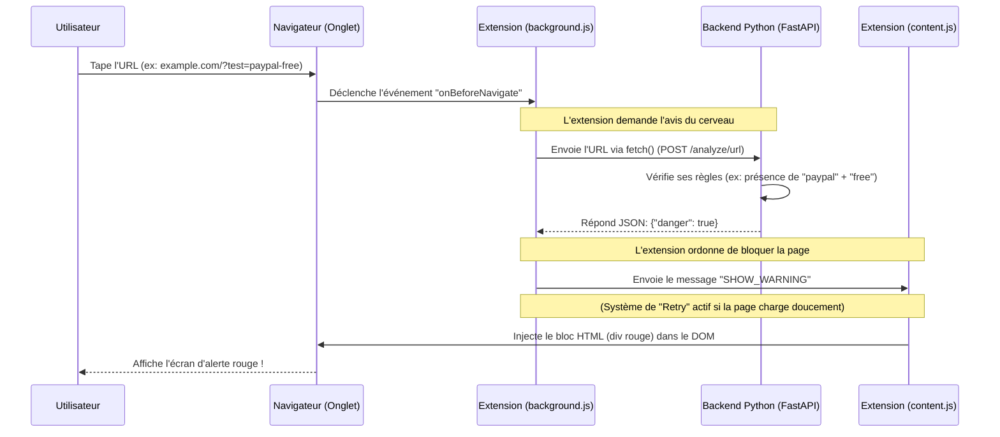

# 🛡️ Architecture & Workflow de ShieldGuard

Ce document explique comment l'extension de navigateur communique avec le backend Python pour détecter et bloquer les sites web dangereux.

## 🔄 Le Workflow (Diagramme de séquence)

Voici ce qui se passe chronologiquement lorsqu'un utilisateur visite un site web :



---

## 📝 Explication étape par étape

### 1. L'interception (`background.js`)
L'utilisateur clique sur un lien ou tape une adresse. **Avant même que la page ne s'affiche**, le script `background.js` (qui tourne en permanence dans l'ombre) détecte cette tentative de navigation.
Il met la requête en pause et extrait l'URL.

### 2. La consultation de l'Oracle (`backend/main.py`)
Le `background.js` ne sait pas de lui-même si un site est dangereux (car les règles de sécurité peuvent changer ou nécessiter de l'intelligence artificielle). Il agit comme un messager : il prend l'URL et l'envoie au Backend Python.
*Le backend est comme un cerveau déporté.* Il analyse l'URL et répond par **Oui (danger)** ou **Non (sûr)**.

### 3. L'ordre d'exécution (`background.js` → `content.js`)
Si le backend répond que l'URL est dangereuse, `background.js` doit afficher une alerte.
Cependant, `background.js` **n'a pas le droit** de toucher visuellement à la page web. Il envoie donc un message par radio (`chrome.tabs.sendMessage`) à l'agent infiltré sur la page : le script `content.js`.

### 4. L'intervention visuelle (`content.js`)
Le script `content.js` est directement injecté au cœur de la page web visitée. Il entend le message radio `"SHOW_WARNING"`.
Il utilise alors ses super-pouvoirs de manipulation du DOM (Document Object Model) pour créer un énorme carré rouge et le coller par-dessus tout le reste du site web, protégeant ainsi l'utilisateur.

---

## 📁 Pourquoi un dossier `icons/` ?

Lors de la toute première étape, tu m'as fourni la structure que tu souhaitais créer, qui incluait un dossier `icons/`. Je l'ai donc créé pour respecter ton plan initial !

**À quoi sert-il en réalité ?**
Dans une extension Chrome professionnelle, ce dossier est indispensable. Il contient le logo de ton extension sous différentes tailles (généralement `icon-16.png`, `icon-48.png`, `icon-128.png`). 

* **16x16** : Utilisé pour le favicon (l'icône dans l'onglet des paramètres de l'extension).
* **48x48** : Utilisé sur la page de gestion des extensions (`chrome://extensions`).
* **128x128** : Utilisé lors de l'installation depuis le Chrome Web Store et pour le gros bouton dans la barre d'outils du navigateur.

Dans le futur, tu pourras ajouter ces images dans le dossier `icons/` et les déclarer dans ton `manifest.json` comme ceci :

```json
  "icons": {
    "16": "icons/icon-16.png",
    "48": "icons/icon-48.png",
    "128": "icons/icon-128.png"
  }
```
Cela donnera une identité visuelle professionnelle à ShieldGuard au lieu de l'icône de puzzle par défaut de Chrome !
